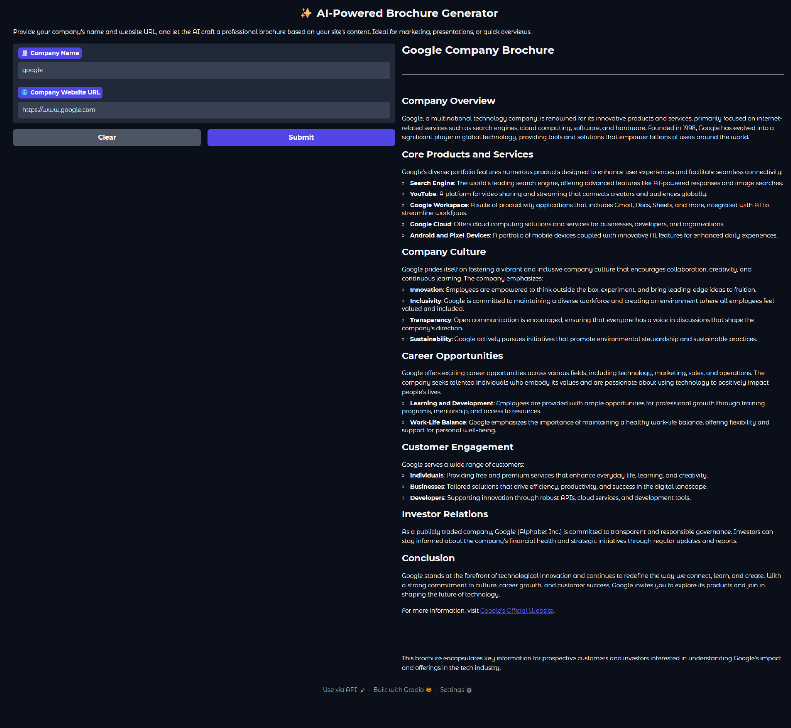

# 🧠 Website Brochure Project

Transform any website into a clean, expressive brochure using LLMs and semantic parsing.

## 🚀 Overview

This project scrapes a given website URL, extracts meaningful content using BeautifulSoup, and generates a brochure-style summary using a local or remote LLM. Designed for modularity, privacy, and educational use, it’s ideal for showcasing company profiles, product pages, or learning resources.

## 🛠️ Features

- 🌐 Website parsing via BeautifulSoup
- 🧩 Modular LLM integration (OpenAI-compatible or LM Studio endpoints)
- 🧠 Semantic chunking for context-aware summarization
- 🔐 Privacy-first design with local model support
- 📄 Markdown output for easy sharing and documentation

## 📦 Installation

```bash
git clone https://github.com/Sanjeevspuranik/website_brochure_project.git
cd website_brochure_project
pip install -r requirements.txt
```

Create a `.env` file in the root directory:

```env
OPENAI_API_KEY=your_openai_key_here
MODEL_ENDPOINT=http://localhost:1234/v1  # Optional: for LM Studio or custom endpoints
```

## 🧠 Example Output

```markdown
Anthropic: Building AI for a Safer Future
About Us
Anthropic is an AI research and deployment company dedicated to building safe and beneficial artificial intelligence. Founded on the principle that powerful AI requires careful consideration of its societal impact, we prioritize human well-being in every aspect of our work – from research and policy to product design. We strive to demonstrate what responsible AI development looks like in practice.

Our Core Values & Approach
AI Safety: Our core mission is to build AI that serves humanity's long-term well-being, proactively addressing potential risks and unintended consequences.
Responsible Scaling: We are committed to developing and deploying AI responsibly, with a focus on safety and societal impact. Our Responsible Scaling Policy outlines our approach.
Transparency & Accountability: We believe in open communication about our research, policies, and product design.
Research-Driven: Anthropic invests heavily in cutting-edge AI research to advance the field safely and effectively.
Key Products & Technologies
Claude
Claude is a family of large language models designed for a wide range of applications. The latest models include:

Claude Opus 4.1: Our most intelligent model yet, offering enhanced capabilities in coding, AI agents, and handling complex tasks.
Claude Sonnet 4: A powerful model excelling at both general and specialized tasks. Notably includes a version with a 1M context window.
Claude Haiku 3.5: A lightweight model ideal for quick and efficient tasks.
Claude Code
Designed specifically for coding, Claude Code helps developers build better software faster. It excels at code generation, understanding, and debugging.

API Platform
Our API platform allows developers to integrate Claude's powerful AI capabilities into their own applications and workflows.

Solutions & Applications
Anthropic's technology is being applied across various industries:

AI Agents: Building intelligent agents that can automate complex tasks.
Code Modernization: Assisting with the modernization of existing codebases.
Customer Support: Enhancing customer service interactions.
Education: Supporting innovative learning experiences.
Financial Services, Government & More: We tailor solutions for a variety of sectors
Careers
Anthropic is growing! If you're passionate about AI and making a positive impact on the world, we encourage you to explore career opportunities: See open roles.

Learn More
Anthropic Academy: A resource for learning how to build with Claude.
Research: Explore our latest research findings and publications.
News: Stay updated on Anthropic's latest announcements, including model releases and policy updates.
Contact Us
Interested in learning more about Anthropic or exploring potential partnerships? Please Speak with sales.
```

## 🧰 Extensibility
- Format outputs for PDF, HTML, or slides

## 📷 Output Image



## 🧑‍💻 Author

Built by [Sanjeev Spuranik](https://github.com/Sanjeevspuranik) — passionate about modular AI systems, semantic search, and educational tooling.
